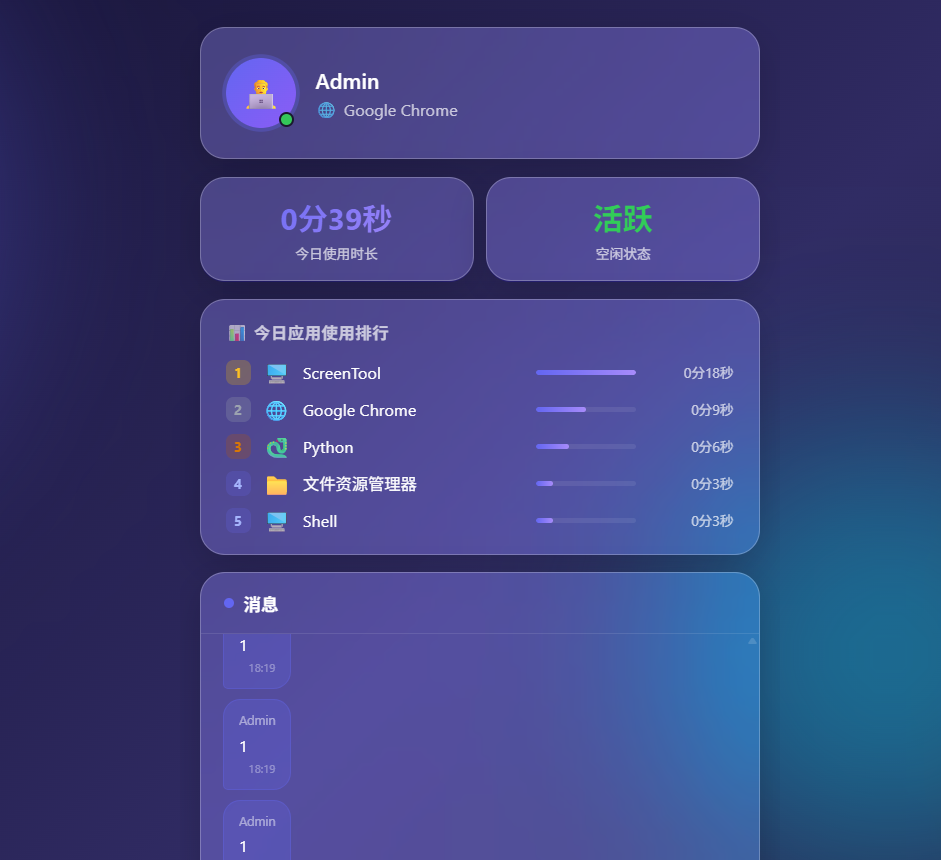
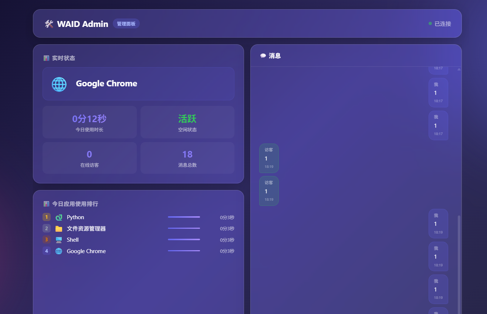

<p align="center">
  
  
  
  
</p>

# 🖥️ What Am I Doing

> **中文文档** | [English](#english)

实时展示电脑使用状态的轻量级工具。Admin 客户端采集前台窗口信息，通过 WebSocket 推送到 Web 前端，让访客了解你正在做什么。

---

## ⚠️ 隐私声明

**在使用本项目前，请务必阅读以下内容：**

- 本工具会采集您设备上的 **前台应用名称** 和 **窗口标题**，并通过网络传输至服务端。窗口标题可能包含文件名、网页标题、聊天对象等个人信息。
- 采集的数据通过 WebSocket 实时传输，服务端以 SQLite 本地存储消息记录，**不使用任何第三方分析或云存储服务**。
- 所有数据均存储在您自己控制的服务器上（`server/data/waid.db`），**项目作者不对任何数据泄露承担责任**。
- 您可以随时通过删除数据库文件、停止 Admin 客户端、或修改代码中的采集范围来终止数据采集。
- **建议**：在面向公网部署前，仔细审查 `admin/client.py` 中的 `get_foreground_window_title()` 和 `get_foreground_app_name()` 函数，按需过滤或脱敏窗口标题中的敏感信息。
- 本项目遵循 MIT 协议开源，**按 "原样" 提供，不提供任何明示或暗示的保证**。

---

## ✨ 核心特性

| 特性 | 说明 |
|:-----|:-----|
| 🖥️ 实时状态 | 显示当前使用的应用名称与窗口标题 |
| ⏱️ 使用时长 | 今日累计使用时长，自动区分活跃 / 空闲状态 |
| 📊 应用排行 | 按使用时长排序的应用排行榜，精确到分秒 |
| 💬 实时聊天 | 访客与 Admin 双向即时通讯 |
| 🔔 消息通知 | 访客消息自动弹出 Windows Toast 通知 |
| 🟢 托盘常驻 | 无控制台窗口，系统托盘后台静默运行 |
| 🪟 玻璃态 UI | iOS 风格毛玻璃界面，暗色主题 |

---

## 📸 产品截图

<table>
  <tr>
    <td align="center"><b>用户端 (User)</b></td>
    <td align="center"><b>管理面板 (Admin Panel)</b></td>
  </tr>
  <tr>
    <td></td>
    <td></td>
  </tr>
</table>

---

## 🏗️ 系统架构

```
┌─────────────────┐     WebSocket      ┌──────────────┐     WebSocket     ┌──────────────┐
│  Admin 客户端    │ ◄──────────────► │    Server     │ ◄─────────────► │  用户前端      │
│  (Python 常驻)   │   状态上报/消息    │  (FastAPI)    │   状态推送/聊天   │  (HTML/JS)    │
└─────────────────┘                    └──────────────┘                   └──────────────┘
                                              ▲
                                              │ WebSocket
                                              │
                                       ┌──────────────┐
                                       │  Admin 面板   │
                                       │  (/admin)     │
                                       └──────────────┘
```

| 组件 | 说明 |
|:-----|:-----|
| **Server** | FastAPI + WebSocket + SQLite，负责状态中转、消息持久化、前端静态托管 |
| **Admin 客户端** | Python 常驻托盘，采集前台应用名 / 窗口标题 / 空闲时长 / 使用时长，WebSocket 上报 |
| **用户前端** | 玻璃态 UI，实时状态展示 + 应用排行 + 聊天 |
| **Admin 面板** | `/admin` 管理面板，实时监控 + 聊天回复 |

---

## 🚀 快速开始

### 1. 克隆项目

```bash
git clone https://github.com/2047327434/what-am-i-doing.git
cd what-am-i-doing
```

### 2. 安装依赖

```bash
# 创建虚拟环境
python -m venv venv
venv\Scripts\activate  # Windows

# 安装 Server 依赖
pip install -r server/requirements.txt

# 安装 Admin 客户端依赖
pip install -r admin/requirements.txt
```

<details>
<summary>📦 依赖详情</summary>

**Server** (`server/requirements.txt`):
- `fastapi>=0.104.0` — 异步 Web 框架
- `uvicorn>=0.24.0` — ASGI 服务器
- `aiosqlite>=0.19.0` — 异步 SQLite 驱动
- `websockets>=12.0` — WebSocket 协议支持

**Admin 客户端** (`admin/requirements.txt`):
- `websockets>=12.0` — WebSocket 通信
- `pystray>=0.19.0` — 系统托盘图标
- `Pillow>=10.0.0` — 托盘图标渲染
- `plyer>=2.1.0` — Windows Toast 通知
</details>

### 3. 启动服务

```bash
# 方式一：一键启动（Windows）
start.bat

# 方式二：手动启动
# 终端 1 — 启动 Server
python server/main.py

# 终端 2 — 启动 Admin 客户端（无窗口模式）
pythonw admin/client.py
```

### 4. 访问应用

| 地址 | 说明 |
|:-----|:-----|
| `http://localhost:8900/` | 用户端 — 查看实时状态 + 聊天 |
| `http://localhost:8900/admin` | 管理面板 — 监控 + 回复消息 |

---

## 🌐 生产部署

将 Server 部署到公网服务器后，修改 Admin 客户端 `SERVER_URL` 指向公网地址即可远程上报：

```python
# admin/client.py
SERVER_URL = "wss://your-domain.com/ws/admin"
```

### Nginx 反向代理配置

```nginx
location / {
    proxy_pass http://127.0.0.1:8900;
    proxy_http_version 1.1;
    proxy_set_header Upgrade $http_upgrade;
    proxy_set_header Connection "upgrade";
    proxy_set_header Host $host;
    proxy_set_header X-Real-IP $remote_addr;
    proxy_set_header X-Forwarded-For $proxy_add_x_forwarded_for;
    proxy_set_header X-Forwarded-Proto $scheme;
}
```

---

## 📁 项目结构

```
what-am-i-doing/
├── server/
│   ├── main.py              # FastAPI 服务端（WebSocket 路由 + REST API + SQLite）
│   └── requirements.txt     # Server 端 Python 依赖
├── admin/
│   ├── client.py            # Admin 客户端（状态采集 + 托盘常驻 + 通知推送）
│   └── requirements.txt     # Admin 客户端 Python 依赖
├── web/
│   ├── index.html           # 用户端前端（状态展示 + 聊天）
│   └── admin.html           # 管理面板前端（监控 + 聊天回复）
├── screenshots/
│   ├── user.png             # 用户端截图
│   └── admin.png            # 管理面板截图
├── start.bat                # Windows 一键启动脚本
├── stop.bat                 # Windows 一键停止脚本
├── .gitignore               # Git 忽略规则
└── README.md                # 项目说明文档
```

---

## 🛠️ 技术栈

| 组件 | 技术 |
|:-----|:-----|
| Server | FastAPI · WebSocket · SQLite · aiosqlite · uvicorn |
| Admin 客户端 | Python · ctypes (Win32 API) · pystray · plyer · websockets |
| 用户前端 | HTML5 · CSS3 (Glassmorphism) · 原生 WebSocket API |
| 部署 | Nginx 反向代理 · WSS 加密 · Docker 可选 |

---

## ⚙️ 配置说明

### 服务端 (`server/main.py`)

| 参数 | 默认值 | 说明 |
|:-----|:-------|:-----|
| `port` | `8900` | HTTP/WebSocket 监听端口 |
| `DB_PATH` | `server/data/waid.db` | SQLite 数据库存储路径 |
| `WEB_DIR` | `../web` | 前端静态文件目录 |

### 客户端 (`admin/client.py`)

| 参数 | 默认值 | 说明 |
|:-----|:-------|:-----|
| `SERVER_URL` | `ws://localhost:8900/ws/admin` | Server WebSocket 地址 |
| `REPORT_INTERVAL` | `3` (秒) | 状态上报间隔 |

---

## 🔌 API 接口

| 方法 | 路径 | 说明 |
|:-----|:-----|:-----|
| `GET` | `/api/status` | 获取 Admin 最新状态（应用名、窗口标题、空闲时长、使用时长、应用排行） |
| `GET` | `/api/messages` | 获取最近 50 条聊天记录 |
| `WS` | `/ws/admin` | Admin 客户端专用 — 状态上报 + 接收访客消息通知 |
| `WS` | `/ws/admin-panel` | Admin 面板专用 — 状态接收 + 聊天收发 |
| `WS` | `/ws/viewer` | 用户端 — 状态接收 + 聊天收发 |

---

## ⚠️ 注意事项

- Admin 客户端仅支持 **Windows** 平台（依赖 `ctypes.windll` 调用 Win32 API 采集窗口信息）
- Server 和用户前端跨平台，可部署在任意操作系统
- 数据库文件存储在 `server/data/waid.db`，已通过 `.gitignore` 排除版本控制
- 对受保护的系统进程（如 UAC 提权进程），应用名称将显示为 `🔒 受保护的应用`
- 应用名称映射表覆盖 30+ 常见应用（VS Code、Chrome、微信、Office 等），可自行扩展 `APP_FRIENDLY_NAMES`

---

## 📄 开源许可

本项目基于 [MIT License](https://opensource.org/licenses/MIT) 开源。

---

<br>

---

<a id="english"></a>

# 🖥️ What Am I Doing

> **English** | [中文](#)

A lightweight tool that displays your real-time computer usage status. The Admin client captures foreground window information and pushes it to a web frontend via WebSocket, letting visitors know what you're currently doing.

---

## ⚠️ Privacy Statement

**Please read the following before using this project:**

- This tool collects **foreground application names** and **window titles** from your device and transmits them over the network to the server. Window titles may contain personal information such as file names, web page titles, or chat contacts.
- Collected data is transmitted in real-time via WebSocket. The server stores message history locally in SQLite — **no third-party analytics or cloud storage services are used**.
- All data is stored on a server under your control (`server/data/waid.db`). **The project author assumes no responsibility for any data breaches.**
- You can terminate data collection at any time by deleting the database file, stopping the Admin client, or modifying the data collection scope in the source code.
- **Recommendation**: Before deploying to a public network, review the `get_foreground_window_title()` and `get_foreground_app_name()` functions in `admin/client.py` to filter or sanitize sensitive information from window titles as needed.
- This project is open-sourced under the MIT License and is provided **"as is", without warranty of any kind, express or implied**.

---

## ✨ Key Features

| Feature | Description |
|:--------|:------------|
| 🖥️ Real-time Status | Display the current application name and window title |
| ⏱️ Usage Tracking | Daily cumulative usage time with automatic active/idle detection |
| 📊 App Ranking | App usage ranking sorted by time, accurate to seconds |
| 💬 Live Chat | Two-way instant messaging between visitors and Admin |
| 🔔 Notifications | Visitor messages trigger Windows Toast notifications |
| 🟢 System Tray | Runs silently in the system tray with no console window |
| 🪟 Glassmorphism UI | iOS-style frosted glass interface with dark theme |

---

## 📸 Screenshots

<table>
  <tr>
    <td align="center"><b>User Interface</b></td>
    <td align="center"><b>Admin Panel</b></td>
  </tr>
  <tr>
    <td></td>
    <td></td>
  </tr>
</table>

---

## 🏗️ Architecture

```
┌─────────────────┐     WebSocket      ┌──────────────┐     WebSocket     ┌──────────────┐
│  Admin Client    │ ◄──────────────► │    Server     │ ◄─────────────► │  Web Frontend │
│  (Python)        │   Status/Msgs     │  (FastAPI)    │   Push/Chat     │  (HTML/JS)    │
└─────────────────┘                    └──────────────┘                   └──────────────┘
                                              ▲
                                              │ WebSocket
                                              │
                                       ┌──────────────┐
                                       │  Admin Panel  │
                                       │  (/admin)     │
                                       └──────────────┘
```

| Component | Description |
|:----------|:------------|
| **Server** | FastAPI + WebSocket + SQLite — status relay, message persistence, static file hosting |
| **Admin Client** | Python system tray app — captures foreground app name, window title, idle time, usage time; reports via WebSocket |
| **User Frontend** | Glassmorphism UI — real-time status display, app ranking, live chat |
| **Admin Panel** | `/admin` dashboard — real-time monitoring, chat replies |

---

## 🚀 Quick Start

### 1. Clone the Repository

```bash
git clone https://github.com/2047327434/what-am-i-doing.git
cd what-am-i-doing
```

### 2. Install Dependencies

```bash
# Create a virtual environment
python -m venv venv
venv\Scripts\activate  # Windows

# Install Server dependencies
pip install -r server/requirements.txt

# Install Admin Client dependencies
pip install -r admin/requirements.txt
```

<details>
<summary>📦 Dependency Details</summary>

**Server** (`server/requirements.txt`):
- `fastapi>=0.104.0` — Async web framework
- `uvicorn>=0.24.0` — ASGI server
- `aiosqlite>=0.19.0` — Async SQLite driver
- `websockets>=12.0` — WebSocket protocol support

**Admin Client** (`admin/requirements.txt`):
- `websockets>=12.0` — WebSocket communication
- `pystray>=0.19.0` — System tray icon
- `Pillow>=10.0.0` — Tray icon rendering
- `plyer>=2.1.0` — Windows Toast notifications
</details>

### 3. Launch

```bash
# Option A: One-click launch (Windows)
start.bat

# Option B: Manual launch
# Terminal 1 — Start the Server
python server/main.py

# Terminal 2 — Start the Admin Client (headless mode)
pythonw admin/client.py
```

### 4. Access

| URL | Description |
|:----|:------------|
| `http://localhost:8900/` | User Frontend — View real-time status + Chat |
| `http://localhost:8900/admin` | Admin Panel — Monitoring + Reply to messages |

---

## 🌐 Production Deployment

After deploying the Server to a public server, update the Admin client's `SERVER_URL` to point to the public address:

```python
# admin/client.py
SERVER_URL = "wss://your-domain.com/ws/admin"
```

### Nginx Reverse Proxy Configuration

```nginx
location / {
    proxy_pass http://127.0.0.1:8900;
    proxy_http_version 1.1;
    proxy_set_header Upgrade $http_upgrade;
    proxy_set_header Connection "upgrade";
    proxy_set_header Host $host;
    proxy_set_header X-Real-IP $remote_addr;
    proxy_set_header X-Forwarded-For $proxy_add_x_forwarded_for;
    proxy_set_header X-Forwarded-Proto $scheme;
}
```

---

## 📁 Project Structure

```
what-am-i-doing/
├── server/
│   ├── main.py              # FastAPI server (WebSocket routes + REST API + SQLite)
│   └── requirements.txt     # Server Python dependencies
├── admin/
│   ├── client.py            # Admin client (status collection + system tray + notifications)
│   └── requirements.txt     # Admin client Python dependencies
├── web/
│   ├── index.html           # User frontend (status display + chat)
│   └── admin.html           # Admin panel frontend (monitoring + chat replies)
├── screenshots/
│   ├── user.png             # User interface screenshot
│   └── admin.png            # Admin panel screenshot
├── start.bat                # Windows one-click start script
├── stop.bat                 # Windows one-click stop script
├── .gitignore               # Git ignore rules
└── README.md                # Project documentation
```

---

## 🛠️ Tech Stack

| Component | Technologies |
|:----------|:-------------|
| Server | FastAPI · WebSocket · SQLite · aiosqlite · uvicorn |
| Admin Client | Python · ctypes (Win32 API) · pystray · plyer · websockets |
| User Frontend | HTML5 · CSS3 (Glassmorphism) · Native WebSocket API |
| Deployment | Nginx reverse proxy · WSS encryption · Docker optional |

---

## ⚙️ Configuration

### Server (`server/main.py`)

| Parameter | Default | Description |
|:----------|:--------|:------------|
| `port` | `8900` | HTTP/WebSocket listening port |
| `DB_PATH` | `server/data/waid.db` | SQLite database storage path |
| `WEB_DIR` | `../web` | Frontend static files directory |

### Client (`admin/client.py`)

| Parameter | Default | Description |
|:----------|:--------|:------------|
| `SERVER_URL` | `ws://localhost:8900/ws/admin` | Server WebSocket address |
| `REPORT_INTERVAL` | `3` (seconds) | Status report interval |

---

## 🔌 API Reference

| Method | Path | Description |
|:-------|:-----|:------------|
| `GET` | `/api/status` | Get latest Admin status (app name, window title, idle time, usage time, app ranking) |
| `GET` | `/api/messages` | Get the 50 most recent chat messages |
| `WS` | `/ws/admin` | Admin client only — status reporting + visitor message notifications |
| `WS` | `/ws/admin-panel` | Admin panel only — status receiving + chat |
| `WS` | `/ws/viewer` | User frontend — status receiving + chat |

---

## ⚠️ Important Notes

- The Admin client supports **Windows only** (depends on `ctypes.windll` for Win32 API calls to capture window information)
- The Server and user frontend are cross-platform and can be deployed on any OS
- Database files are stored in `server/data/waid.db` and excluded from version control via `.gitignore`
- For protected system processes (e.g., UAC-elevated processes), the app name will display as `🔒 Protected App`
- The app name mapping covers 30+ common applications (VS Code, Chrome, WeChat, Office, etc.) and can be extended via `APP_FRIENDLY_NAMES`

---

## 📄 License

This project is licensed under the [MIT License](https://opensource.org/licenses/MIT).
